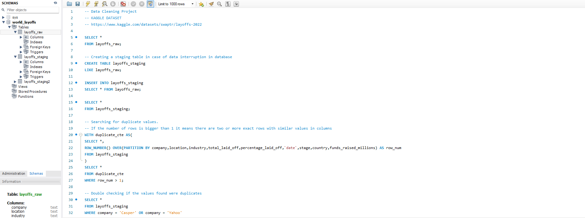
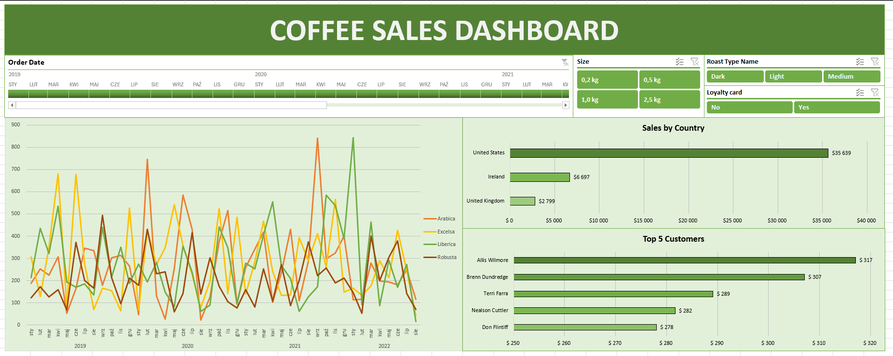
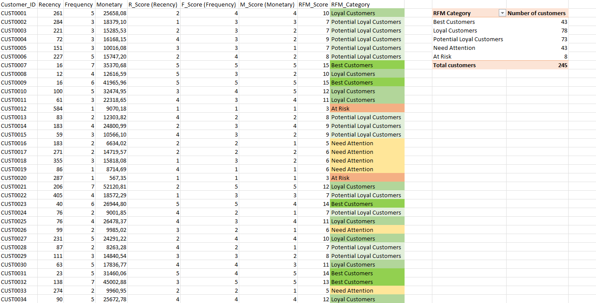
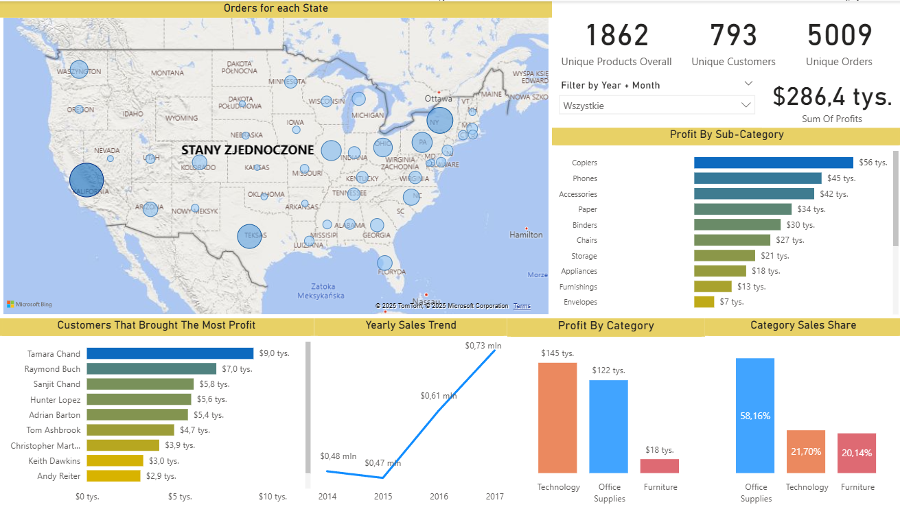
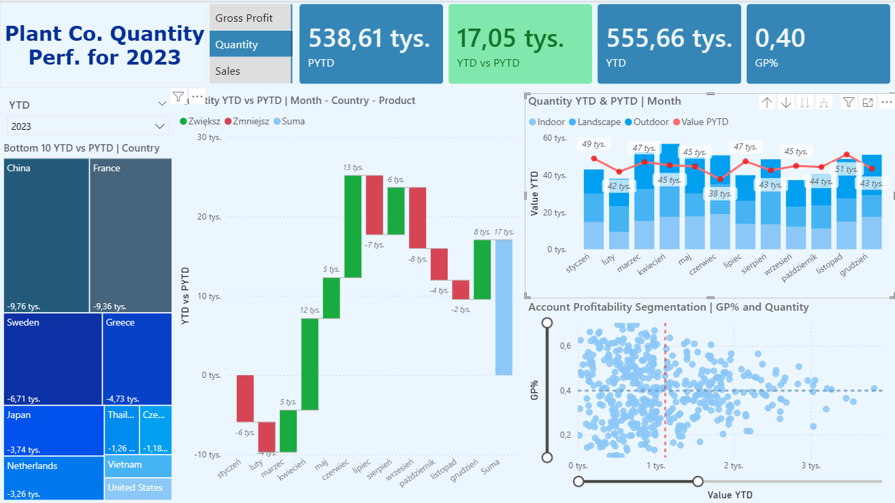
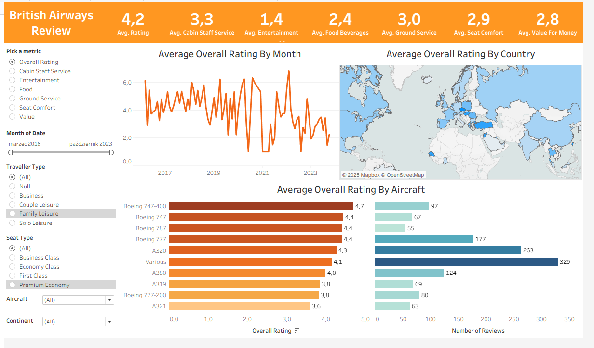

# Data Hub

### Data analytics portfolio covering Python, SQL, Excel, Power BI, Tableau, and n8n projects.

For more details, open a project by clicking its preview image.

- [Python](#python)
- [SQL](#sql)
- [Excel](#excel)
- [Power BI](#power-bi)
- [N8N](#n8n)
- [Tableau](#tableau)

# Python

#### CenoMetr | Apartment Price Prediction
End-to-end machine learning project combining real-estate data preparation, feature engineering, model comparison, and apartment price prediction.

#### CRM-ERP Reconciliation Pipeline | Python ETL Project
ETL pipeline extracting data from CSV and REST API sources, validating and reconciling CRM and ERP records, and loading results into MySQL.

# SQL

#### Layoffs Data Cleaning
SQL data-cleaning project using staging tables, window functions, standardization, NULL handling, and data type transformations to prepare raw data for analysis.

#### E-Commerce Warehouse KPI Analysis
Warehouse analytics project using SQL to measure Return Rate, Lead Time, Order Cycle Time, Fill Rate, and Cost per Shipment across the logistics process.

# Excel

#### Coffee Orders Project
Interactive Excel sales dashboard using lookup formulas, Pivot-based analysis, slicers, and visualizations to explore products, customers, and geographic performance.

#### Tile Store RFM | Customer Segmentation Analysis
RFM customer segmentation project using Pivot Tables, dynamic formulas, and quantile-based scoring to classify customers by recency, frequency, and monetary value.

# Power BI

#### Superstore Sales Dashboard
Interactive Power BI dashboard analyzing sales, profitability, customer segments, product categories, geographic performance, and historical trends.

#### Plant Co. Performance Dashboard
Power BI performance dashboard using a star schema, DAX time intelligence, dynamic metric switching, and YTD vs PYTD analysis across products, customers, and markets.

# N8N

#### AI Product Data Processing Pipeline
Automated product data processing and AI enrichment workflow built in n8n, combining XLSX validation, data transformation, batch processing, Google Gemini integration, structured output validation, and final dataset export.

# Tableau

#### British Airways Review Dashboard
Interactive Tableau dashboard analyzing passenger satisfaction across service categories, aircraft types, traveler segments, geographic regions, and time periods.

